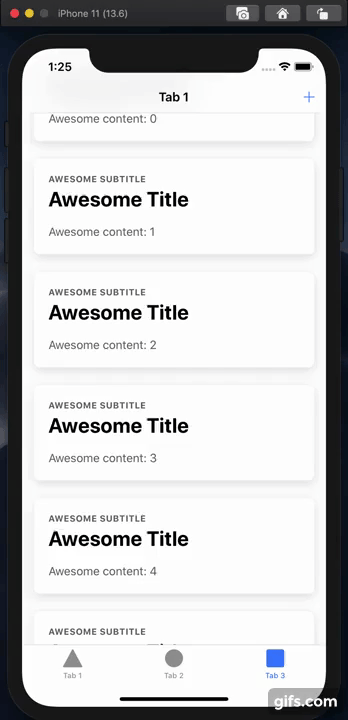

# Ionic + Capacitor Demo

An Ionic application with a [collapsable large title](https://ionicframework.com/docs/api/title#collapsible-large-titles) can cause scroll issues. So the user can not scroll all the way down on the page.

This only happens on the first render. When you switch back and forth between tabs, or cause a repaint in a different way, the height of the scrollable content will be correct.

Mark the scrollbar position and the bounce effect:



# Run

```
npm i
npm run build
npx cap sync ios
npx cap open ios
# run the app via xCode
```

```
# or, with livereload:
ionic capacitor run ios --livereload
# run the app via xCode
```
